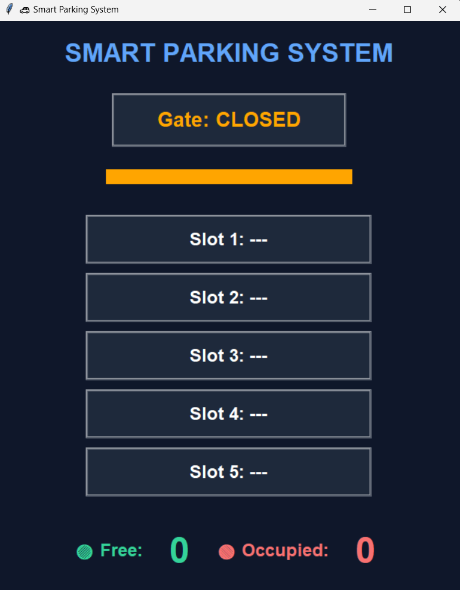
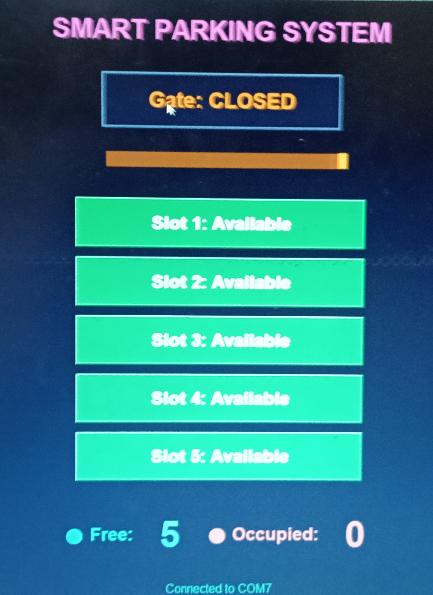

# 🚗 Smart Parking System with Servo Gate & Python GUI

## 📌 Project Description
The Smart Parking System is an embedded automation project designed to efficiently manage parking spaces using IR sensors, Arduino, LED indicators, and a servo motor-controlled gate. It also includes a Python-based GUI for real-time monitoring and visualization.

The system detects vehicle presence in parking slots, controls gate entry automatically, and displays live parking status such as available slots, occupied slots, and gate condition.

---

## 🎯 Objectives
- Automate parking slot detection using IR sensors  
- Control entry gate using a servo motor  
- Display real-time parking status using Python GUI  
- Reduce manual effort and parking time  
- Improve parking space utilization  

---

## 🛠️ Technologies Used

### Hardware:
- Arduino Uno / Nano  
- IR Sensors (6 total: 5 slots + 1 gate)  
- Servo Motor (SG90)  
- LEDs (Red & Green for each slot)  
- Breadboard & Jumper Wires  

### Software:
- Arduino IDE  
- Python 3  
- Tkinter (GUI)  
- PySerial (Serial Communication)  

---

## ⚙️ Features
- Automatic vehicle detection  
- LED indication (Green = Free, Red = Occupied)  
- Servo-based automatic gate control  
- Real-time GUI display  
- Slot count (Free & Occupied)  
- Serial communication between Arduino & Python  

---

## 🧩 System Working
1. IR sensors detect vehicle presence in each slot  
2. LEDs indicate slot status:
   - Green → Available  
   - Red → Occupied  
3. Entry IR sensor detects vehicle at gate  
4. Servo motor opens the gate automatically  
5. Arduino sends slot data via serial communication  
6. Python GUI displays:
   - Slot status  
   - Free/Occupied count  
   - Gate status (Open/Closed)  

---


## 📸 Output Screenshot

           

## 🎥 Demo Video


[▶️ Watch Demo Video](https://drive.google.com/file/d/1WXuQTNLrji8yVlDy5RD6f9Gco8Oxmd19/view?usp=sharing)


## 📂 Project Structure
```bash

SMART PARKING SYSTEM/
│
├── parking_system.ino/
│   └── parking_system.ino
│
├── Screenshot/
│   ├── ScreenShot.png
│   └── ScreenShot2.jpg
│
├── README.md
│
└── smart_parking_gui.py 

``` 
---

## 🔌 Hardware Connections
- Entry IR Sensor → Pin 9  
- Servo Motor → Pin 8  
- Slot Sensors → Pins 2, 5, 6, 7, A5  
- LEDs → Multiple digital pins  
- Serial Communication → USB (9600 baud)  

---

## 🚀 How to Run the Project

### Step 1: Upload Arduino Code
- Open Arduino IDE  
- Upload `smart_parking_system.ino`  

### Step 2: Install Python Dependencies
pip install pyserial

### Step 3: Run Python GUI
- Open parking_display.py
- Set correct COM port (e.g., COM7)
- Run the script

### Step 4: Observe Output
- GUI shows live parking status
- Gate opens when vehicle is detected

## 📊 Functional Highlights
- Real-time slot monitoring
- Automatic gate control
- Serial data transmission
- GUI-based visualization

## 📜 Conclusion

This project demonstrates how embedded systems and software integration can provide an efficient and cost-effective parking solution. It reduces human effort, improves user convenience, and serves as a foundation for smart city applications.

## 👨‍💻 Authors
Sanjeevi V P, 
Srilaxman E U, 
Muthu Selvam V
